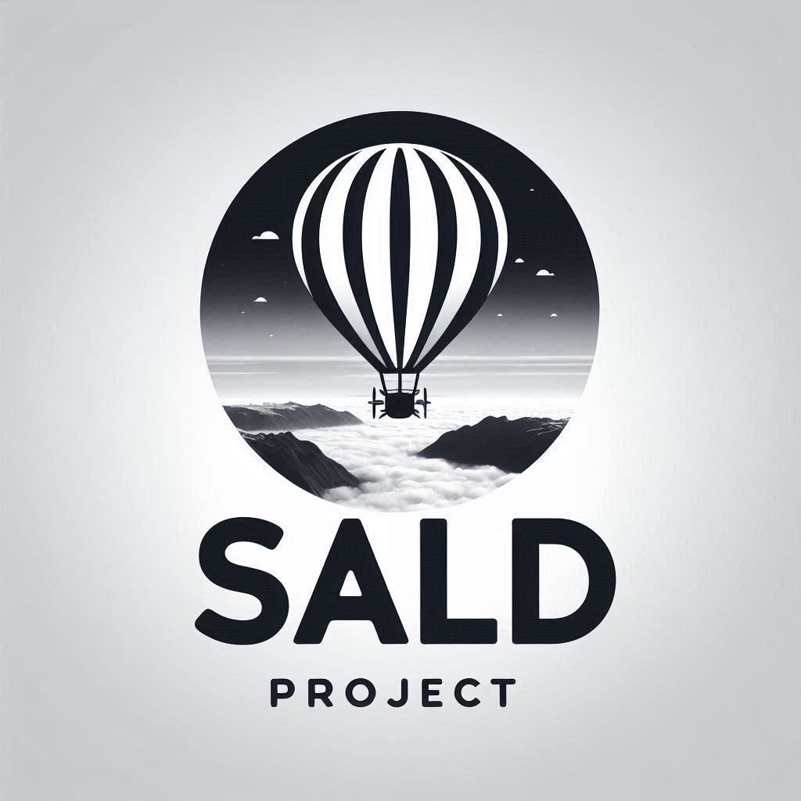

# **SALD - Storage and Launch Drone Systems via Helium Balloons**

  

**Project Overview**

The **SALD (Storage and Launch Drone Systems via Helium Balloons)** project introduces a groundbreaking method for deploying drones using high-altitude helium balloons. This system involves the use of an automated and remotely controlled container that houses drones, which can be released one by one for military, tactical, or strategic operations. The **SALD** system is designed to allow the remote deployment of drones from a helium balloon, enabling flexible and rapid responses in key areas.

The helium balloons will reach altitudes higher than conventional aircraft but lower than satellites, providing a versatile platform for drone release over strategically significant areas. The system's container, measuring 1x1 cubic meter, will remain attached to the balloon while releasing drones individually for specific tasks.

## **Key Features and Components**

- **Helium Balloons**: The helium balloons will operate at altitudes ranging between 18,000 and 30,000 meters (18-30 km), above the typical operating altitude of commercial aircraft (10-12 km) but far below the altitude of satellites (around 500 km). This altitude range allows for versatile drone deployment in strategic areas.

- **Drone Deployment System (SALD)**: The container measures 1x1 cubic meter and houses several drones along with the automated launch system. Once deployed, drones are released one at a time, ensuring precise control over deployment and operational flexibility. The container itself remains tethered to the helium balloon, allowing for future drone releases.

- **Multi-Drone Deployment**: The system is designed to support the simultaneous deployment of multiple drones, allowing for larger-scale operations and the flexibility to carry out different missions concurrently.

- **Remote Control & Automation**: The SALD system is fully automated and remotely controlled, allowing real-time monitoring and activation of drones during missions. This system offers flexibility for multiple uses, from reconnaissance to tactical operations, all while minimizing the need for direct human intervention.

## **Operational Altitudes**

- **Commercial Aircraft Altitude**: Commercial aircraft generally fly between 10,000 and 12,000 meters (10-12 km).

- **Helium Balloons for Meteorological Studies**: Helium balloons, commonly used for weather studies and atmospheric research, typically reach altitudes between 18,000 and 30,000 meters (18-30 km).

- **Low Earth Orbit Satellites**: Satellites in low Earth orbit (LEO) operate at altitudes ranging from 300 to 2,000 kilometers, much higher than the operational range of the helium balloons.

### **Advantages of Helium Balloon Deployment**

- **Strategic Flexibility**: The helium balloon provides a highly flexible and reusable platform for the deployment of drones in areas that are difficult to access by traditional aircraft or satellite methods.

- **Cost-Effective**: Compared to satellite-based drone deployments or aircraft-based methods, helium balloons offer a more economical and scalable solution, reducing both operational costs and infrastructure requirements.

- **Precision Deployment**: With the ability to release drones individually, the system allows for precise and controlled deployment over specific regions, making it ideal for reconnaissance or military operations where strategic flexibility is essential.

## **Use Cases**

- **Military and Tactical Operations**: SALD enables the rapid deployment of drones in remote or high-risk environments, offering surveillance, reconnaissance, and tactical support on demand.

- **Disaster Relief**: The system can be adapted for use in disaster-stricken areas, where it can deliver drones for immediate aerial surveillance, communications, or supply drops.

- **Strategic Reconnaissance**: By operating at altitudes above commercial aircraft but below satellites, SALD can be used to conduct high-altitude reconnaissance in areas where access is limited, providing real-time intelligence to decision-makers.

## **How It Works**

1. **Launch**: The helium balloon is inflated and launched to an altitude above 18,000 meters, above the operational range of commercial aircraft but below the altitude of satellites.
   
2. **Drone Deployment**: Once the balloon reaches the target altitude, the SALD container remains tethered to the balloon, while drones are released one by one. Each drone can be activated individually, providing the flexibility to perform various tasks on demand. 

3. **Simultaneous Drone Deployment**: The system can deploy multiple drones at once if needed, providing large-scale operational capabilities, ideal for complex missions requiring several drones in different areas.

4. **Drone Operations**: After release, the drones perform autonomous missions, such as surveillance or reconnaissance, while being controlled remotely. Once completed, the drones either return to a designated recovery zone or continue operations until the mission is finished.

5. **Reusable Container**: After releasing all drones, the SALD container remains attached to the helium balloon, ready for future drone deployments.

## **Project Goals**

- **Develop a scalable helium balloon system for drone deployment.**
- **Create a robust and reliable drone deployment system that allows for one-by-one and multi-drone releases.**
- **Ensure efficient remote control and real-time monitoring for all deployed drones.**
- **Provide an economical alternative to satellite or aircraft-based drone deployment systems.**

## **Future Enhancements**

- **Payload Capacity Expansion**: Increase the payload capacity of the helium balloon to support larger or additional systems, such as sensors or communication relays.

- **AI-Powered Autonomy**: Integrate AI capabilities to allow for autonomous mission planning and real-time decision-making for drone deployment.

---

### **Conclusion**

The **SALD** project merges innovative drone technology with high-altitude helium balloons to provide a cost-effective and strategic solution for drone deployment. By enabling the release of drones one at a time, and the ability to deploy multiple drones simultaneously, from a remote-controlled, reusable platform, SALD offers unmatched flexibility for military, tactical, and strategic operations.

---

